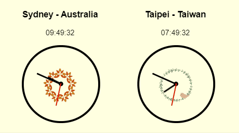

# React-COVID-19-Stats

- A React project to visualise COVID-19 data in Australia and Taiwan.

- GitHub Repo: https://github.com/EllieChen-Git/React-COVID-19-Stats

- Deployed Site: https://covid-19-stats-aus-tw.netlify.app/

---

### Features

##### <u>General</u>

1. Use [React Hooks](https://reactjs.org/docs/hooks-overview.html).
2. Use [Error Boundary](https://reactjs.org/docs/error-boundaries.html#introducing-error-boundaries) to handle errors at the App (global) level.
3. Use [React Context](https://reactjs.org/docs/context.html#reactcreatecontext) to create theme colour options: This is an overkill here, but I just wanted to practice my knowledge on React Context.

Example: Once users select the theme colour, the colour of the form submit button and the section title on the table, graph, form & form results will change accordingly.

##### <u>Seasonal clocks</u>

1. Presenting two clocks in different time zones with a ticking effect.
2. Clock faces will change depends on the current season in the Northern hemisphere (Taiwan) and the southern hemisphere (Australia).

Example 1: April is Autumn in Australia & Spring in Taiwan

Example 2: December is Summer in Australia & Winter in Taiwan

##### <u>Comparison Table</u>

1. Comparing the total cases, active cases, recovered cases, deaths and tests in Australia and Taiwan.
2. Retrieving data with axios and a public API.

##### <u>Interactive Graph</u>

- Interactive graph with a third-party package [Rechart](https://recharts.org/en-US/).

##### <u>Historical Data Form</u>

1. Displaying historical data (axios with a public API) based on selected options.
2. Displaying search results in pagination.

##### <u>Social buttons to share this site</u>

- Providing share functionality to share this site to major social media (Facebook, Facebook Messenger, email, Line, LinkedIn, Twitter and WhatsApp) with a third-party package [React-Share](https://github.com/nygardk/react-share#readme).

---

### Project Goals (What I want to learn/practice in this project)

- Refresh my knowledge of consuming public APIs and displaying data in React. :heavy_check_mark:
- Use Material UI for design (I usually use Bootstrap in my personal projects). :heavy_check_mark:
- Use TypeScript to write React App (https://create-react-app.dev/docs/adding-typescript/). 🔺
- Implement end-to-end testing: cypress (or other end-to-end testing). 🔺

---

### Reflection

- **Learning vs Coding**

This is the first time I used React Hooks in my personal projects. Before this, I had read the React documentation and practised with several online tutorials. However, it still took me some time to learn how to 'actually' use React Hooks 'properly'. I re-visited React docs and my notes several times and also read more posts online. I'm glad that now I feel more confident in using React hooks.

<u>Lesson: You'd never know whether you understand a concept or learn a skill until you put it into practice.</u>

- **Doing your own projects vs Following online tutorial**

When I follow tutorials, I don't have to worry much about the next steps. Even when there are bugs, the only thing I need to do is going back to the previous slides or rewinding the video to double-check the source code. However, when I was working on this project, I felt lost so many times. Sometimes I didn't know where to start, what to do next, and I had no idea what the best approach was. So I wrote the initial code and then kept going back to refactoring my code with different approaches. But I guess that's how you learn to program. Practice makes perfect.

<u>Lesson: While learning, remember to always keep a 'why' attitude in mind. Ask yourself 'why the instructor decides to take certain approaches', ask 'what are the programming principle/theory behind the scene', read the error messages carefully before blindly trying different online solutions and hope one of them would just work.</u>

- **Planning vs Reality**

In my initial planning session, everything looked so easy and shouldn't take up much time. In reality, it took me so long to implement each component, and there are still certain functionalities I didn't have time to implement after working on this project for a month.

<u>Lesson: Know yourself better and set more realistic goals.</u>

---

### Project Management

- **Building Process**

  1. Brainstorming side project ideas.
  2. Locating the APIs I want to use.
  3. Quick wireframing of the site.
  4. Creating the app with 'create-react-app' and setting up file structure.
  5. Breaking down project components & estimating time for each task.
  6. Coding & debugging.
  7. Styling (responsive web design) & polishing documentation.

- **Time Estimation & Outcome**

|                :star: Task :star:                 | Initial Estimation | Actual Implementation |
| :-----------------------------------------------: | :----------------: | :-------------------: |
|              Planning & wireframing               |        2hrs        |        4.5hrs         |
|         Seasonal Clocks (AUS & TW times)          |        1hr         |         7hrs          |
|         Comparison table (consuming API)          |        3hrs        |         8hrs          |
|           Form: React Hooks (dropdown)            |        2hrs        |         13hrs         |
|       Trend graph (date & confirmed deaths)       |        3hr         | 1.5hrs (use package)  |
| Public exposure cases in suburbs: Google maps API |        3hrs        |      (cancelled)      |
|                  Comment section                  |        3hrs        |      (cancelled)      |
|         Social media share functionality          |        2hrs        | 1.5hrs (use package)  |
|            Theme colour: React Context            |        1hr         |        1.5hrs         |
|       Error handling: React Error Boundary        |        1hr         |        1.5hrs         |
|     Converting from JavaScript to TypeScript      |        5hr         |       (not yet)       |
|          Styling & responsive web design          |        3hrs        |        5.5hrs         |
|              Polishing documentation              |        1hr         |          1hr          |
|                       Total                       |       30hrs        |         45hrs         |

---

### Future Features

1. Converting code from JavaScript to TypeScript.

2. Implementing end-to-end testing for single page application.

---

©2020 Ellie Chen - All Rights Reserved.
